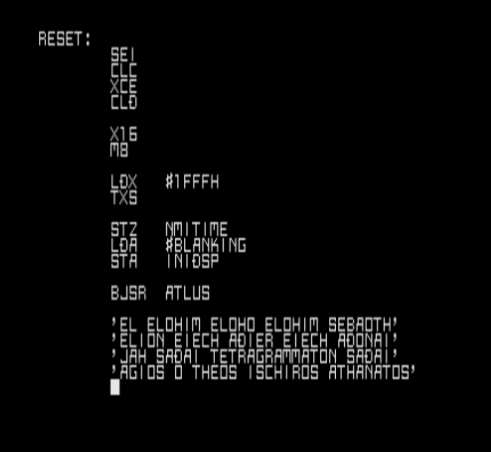

  

# Hi, I'm Guilherme (Aka Ulvv)

I'm a Computer Science student at **UFRJ** exploring how computers actually work under the hood—from bare-metal and OS design to compilers and memory models. I like to avoid too many abstractions. I'm fluent in English and looking to learn another language in the future (not sure which one yet).

While my heart belongs to low-level systems, I enjoy exploring whatever is needed to build something cool.

---

### What I'm up to:
- Studying Computer Science at **UFRJ** (Universidade Federal do Rio de Janeiro).
- Diving deep into **Operating Systems**, memory management, and systems programming.
- Writing mostly **C** and **C++**, learning assembly, and tinkering with Linux (also some web stuff here and there).

---

### My favourites:

**Languages:**  

**Systems & Tools:**  

---

### Stats

  

---

### How to reach out to me:

